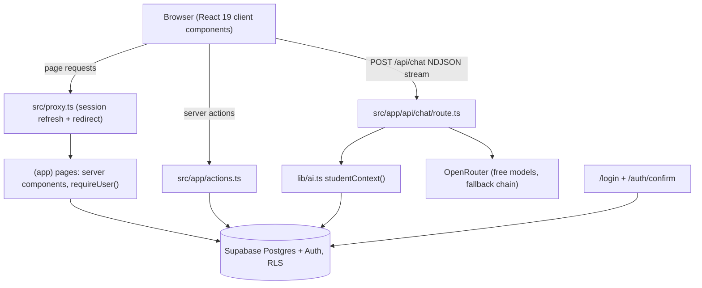
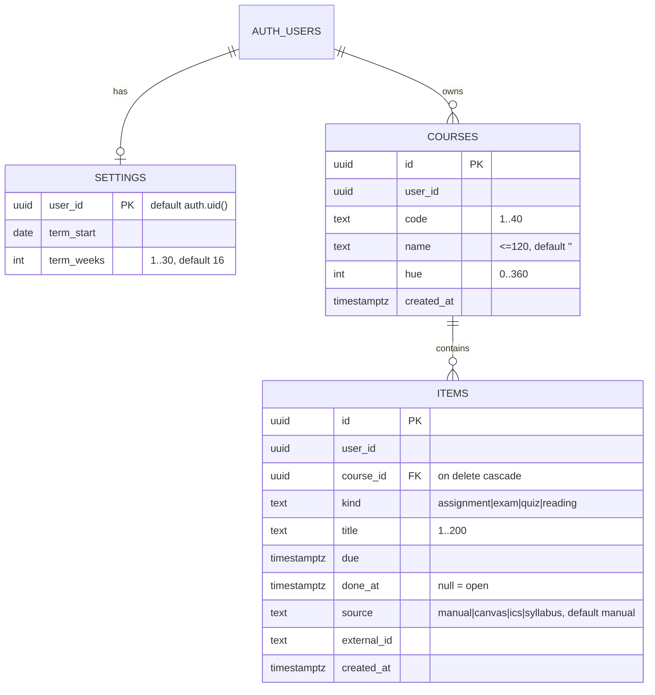

# PROJECT HANDOFF

> Written 2026-09-23 at the end of a long Claude Code conversation, for a fresh Claude Code instance that has the repository but not the conversation. Repository state was inspected while writing this (git clean, 27 commits on `main`, `npm test` 6/6, `tsc` clean, lint clean). If the repo has moved on since, **the code wins over this document**.

---

## 1. Executive Summary

- **Project:** **Sonnet** (repo `g5haco/sonnet`, private; live at **https://www.ericwei.me**, apex `ericwei.me` redirects to `www`).
- **What it is:** a web app for a college student that puts everything in one place: all assignments/exams/quizzes/readings across courses, how caught up you are (a big progress readout + weekly bars), what's next, an exam countdown, and a **global AI assistant** (right-side chat panel) that knows all your courses and deadlines and can add/change items after you confirm.
- **Stage:** personal MVP, in active development. Phases 0–3 of the roadmap are done (foundation, items & progress, app shell, AI assistant). **Phase 4 (Calendar) is next.**
- **Who it's for right now:** one user (the owner, a college student) using it daily. Sign-ups are closed.
- **Success for the current phase:** the owner opens Sonnet daily instead of Canvas; every deadline is in it; the assistant answers correctly and quickly. Next milestone: a Calendar page with class times, due dates and exams.

## 2. Original Product Vision

**Problem:** college students juggle 4–6 courses, each with its own syllabus and Canvas page; existing tools do one thing each (StudyFetch = AI tutor, MyStudyLife = organizer, Motion = scheduler, BlockPlan = semester plan, DormWay = Canvas sync, Notion = DIY). The owner wants **one minimal, easy tool** with the most important parts only.

**LONG-TERM PRODUCT VISION**
- Canvas sync (token + calendar feed), syllabus AI import (PDF/image/Word), manual entry.
- Unified to-do + semester timeline + calendar (classes, due dates, exams) + Google Calendar feed.
- AI assistant: course-aware tutor, assignment summaries, exam study guides, planning ("start by" dates), can create/edit items.
- Materials hub: upload PDFs, PowerPoints, Word, photos, notes, links; later audio/video/YouTube/lecture recording.
- Grades + what-if ("what do I need on the final").
- Focus (Pomodoro) timer + study heatmap/streak; light gamification only.
- **SaaS later** (explicitly "second step"): multi-user sign-up, landing page, Stripe, real email provider (Resend), Canvas OAuth developer key, two-way Google Calendar, auto time-blocking.
- Differentiator: all-in-one but minimal; design "precise, tactile, cheeky" (not institutional like Canvas, not childish gamification).

**CURRENT PERSONAL MVP**
- Single user; sign-ups closed; everything under row-level security so SaaS is additive later (not a rewrite).
- Free AI (OpenRouter free models) instead of paid Claude.
- Chat history is session-only (not saved).
- No payments, no landing page, no email provider, no Canvas OAuth.
Do **not** pull SaaS requirements into the MVP unless the user asks.

## 3. Current Scope

**Current milestone:** Phase 3 (AI assistant) just finished → **Phase 4: Calendar** is next.

**Included and working now:**
- Email+password login (email magic link as fallback), sign-ups closed.
- Courses (add, rename, delete with two-step confirm), items (assignment/exam/quiz/reading: add, check off, delete with undo, show done).
- Semester settings (start date + weeks) with first-run setup.
- Home dashboard: greeting + status line, Progress block (caught-up %, weekly bars, delta vs last week), Up next list, Next exam ring, This week strip, Grades (placeholder) and Study days (placeholder).
- App shell: animated sidebar, gooey Create "+" menu, Settings page, Calendar and Materials placeholder pages.
- Global AI chat panel: streaming answers from real data, shortcut chips, voice dictation, Think toggle, auto-reasoning, proposal cards (AI proposes add/update; user confirms).

**Intentionally excluded right now / deferred:**
- Calendar views, class times (Phase 4); Canvas sync (Phase 5); Materials/uploads/syllabus import (Phase 6); real grades (Phase 7); focus timer + heatmap data (Phase 8).
- Chat history persistence (decided: session only for now).
- Audio/video/YouTube uploads, lecture recording, Quizlet import (no public API), two-way Google Calendar, auto time-blocking, XP/badges/points.
- Custom sign-in email template (Supabase requires custom SMTP to edit templates; skipped).

**Temporary shortcuts in place:**
- Grades block shows courses with "–" ("with Canvas sync"); Study days shows one line ("with the focus timer").
- Calendar/Materials pages are honest "coming in phase N" placeholders (`src/components/coming-soon.tsx`).
- Context says "Class times: not added yet." (hard-coded in `src/lib/ai.ts` until Phase 4 adds the table).

## 4. User Preferences and Development Philosophy

- **Work in steps, keep the user updated, never one-shot.** Present a plan/roadmap before big work; get approval for design/scope changes; report after each step.
- **Commit and push every important change to GitHub `main` immediately** (user asked twice: "do this every time, don't forget"). Commit even if not fully testable yet, but say "untested" in the message. Work directly on `main` (the `phase-0` branch was deleted in cleanup). Commit messages end with `Co-Authored-By: Claude Opus 5.5 <noreply@anthropic.com>` (use whatever attribution the current system prompt specifies).
- **Ponytail (minimal code) for all code:** fewest files, no speculative abstractions, reuse installed deps, native/platform features first, one small test for non-trivial logic. Comments explain *why*, briefly.
- **Design skills:** the user wants **impeccable**, **ui-ux-pro-max** and **taste-skill** (`design-taste-frontend`) used together for UI work; **GSAP skills** (gsap-core, gsap-react, gsap-timeline, gsap-performance) and **Genjutsu** (motion-principles, gsap, css-native) for animation. Prefer **shadcn** and **Kibo UI** components over hand-coding. Use **Libraries.dev** components where they fit (see §12).
- **Be smart with components, not mindless:** each fancy component needs a rule for why it's there.
- **Minimal, easy to use, not overwhelming;** light gamification only ("minimal").
- **Honesty in UI:** never fake data or fake AI answers; placeholders say what's coming and when.
- The user **vibecodes** (relies on Claude to write all code), is a college student, uses Windows. Explain things in plain language; give step-by-step instructions for dashboards (Supabase, Vercel, IONOS, OpenRouter) and ask for screenshots when a UI differs.
- **Secrets:** the user should put secrets into `.env.local` and Vercel themselves; don't ask them to paste secret keys into chat. (They did paste the Supabase publishable key, which is public by design.)
- **Free > paid** for AI: the user explicitly asked for a free alternative to an Anthropic key → OpenRouter free models.
- Keep the **roadmap file current** (`docs/ROADMAP.md`) and don't drop original roadmap items; the user checked that nothing got lost when phases were reordered.
- User wants **speed** in AI replies, but reasoning when it matters (tutoring) → auto + toggle (see §11).

## 5. Architecture Overview

- **Next.js 16 App Router** app (TypeScript) deployed on **Vercel** (auto-deploys every push to `main`).
- **Supabase**: Postgres (tables with row-level security), Auth (email+password, magic link). No Storage yet.
- **Server actions** (`src/app/actions.ts`) do all writes; **server components** read data per page.
- **Route handler** `POST /api/chat` streams the AI answer (NDJSON) from **OpenRouter** (OpenAI-compatible API).
- **Proxy** (`src/proxy.ts`, Next 16's renamed middleware) refreshes the Supabase session cookie and redirects signed-out visitors to `/login` (optimistic); each page re-checks with `requireUser()` (layouts don't re-run on navigation).
- **Client state:** React state in `AppShell` (dialogs, chat messages, docked/sheet), `useOptimistic` for check-offs in `Dashboard`. No global store library.
- No background jobs, queues or cron yet (Canvas daily sync planned in Phase 5 via Vercel Cron).



## 6. Technology Stack

**Installed and actively used** (versions from `package.json`):
| Tech | Version | Why |
|---|---|---|
| Next.js (App Router, Turbopack) | 16.3.6 | Chosen stack; note breaking changes vs training data (see AGENTS.md: read `node_modules/next/dist/docs/`). Middleware is now **Proxy** (`src/proxy.ts`). |
| React | 19.2.8 | |
| TypeScript | ^5 | |
| Tailwind CSS | ^4 | Utility styling; v4 `@theme` tokens, container queries (`@container`, `@3xl:`) used on dashboard. |
| shadcn/ui (style `base-nova`, **Base UI** primitives, not Radix) | shadcn ^4.21 | Components: button, checkbox, dialog, dropdown-menu (now unused), sonner. Uses the `cn` npm package (shadcn's official class merger). |
| Kibo UI | registry | `theme-switcher` (Settings), `contribution-graph` (vendored, **currently unused**, reserved for Phase 8 heatmap). Vendored under `src/components/kibo-ui/**`, excluded from lint. |
| Supabase (`@supabase/supabase-js`, `@supabase/ssr`) | ^2.117 / ^0.12.7 | DB + auth; `getClaims()` for auth checks. |
| motion (formerly framer-motion) | ^13.4.1 | Sidebar width/overlay, chat sheet, chat input animations. Also a dependency of Kibo theme switcher. |
| GSAP + @gsap/react | ^3.15 / ^2.1.2 | Rolling numbers + "week cleared" timeline (`src/lib/gsap.ts`, `progress-block.tsx`). |
| liquid-gooey | ^0.2.2 | Gooey Create "+" menu. |
| metal-fx (v2) | ^2.0.11 | Silver metal ring on AI send button, Ask button; `MetalBadge` "AI" on proposal cards. |
| thinking-orbs | ^0.3.2 | Assistant status orbs. |
| voice-glow | ^0.2.1 | Glow around chat input while dictating (`ice` palette). |
| next-themes | ^0.4.6 | Light/dark/system (class strategy). |
| sonner | ^2.0.8 | Toasts (close button enabled). |
| lucide-react | ^1.47 | Icons. |
| date-fns | ^4.4 | Pulled in by Kibo contribution-graph. |
| Vitest | ^5.0.1 | Unit tests (`npm test`). Required `@types/node@^24`. |
| Fonts | Geist + Geist Mono (next/font) | Mono for readouts/labels. |

**Planned, not implemented:** Supabase Storage (materials), Vercel Cron (Canvas sync), ICS feed, Kibo `calendar`/`mini-calendar`/`dropzone` (considered for Phases 4/6), `react-dropzone` (Kibo dependency).

## 7. Repository Map

```text
/
├── HANDOFF.md                 ← this file
├── AGENTS.md / CLAUDE.md      ← Next 16 agent rules (auto-written by next dev); CLAUDE.md just includes AGENTS.md
├── PRODUCT.md                 ← impeccable product context: users, personality, anti-references, principles
├── README.md
├── .env.example               ← env var names (no secrets)
├── .claude/launch.json        ← preview server config ("dev": npm run dev, port 3000)
├── .impeccable/critique/      ← saved impeccable critique snapshot (23/40 before fixes)
├── docs/
│   ├── ROADMAP.md             ← phase table + status + old→new phase map (keep current!)
│   └── superpowers/
│       ├── specs/2026-09-22-student-hub-design.md          ← v1 spec
│       ├── specs/2026-09-23-shell-ai-calendar-materials-design.md ← v1.5 spec (shell, AI, calendar, materials)
│       └── plans/2026-09-22-phase-0-foundation.md          ← Phase 0 plan (historical)
├── supabase/migrations/0001_init.sql  ← settings, courses, items + RLS (APPLIED by the user)
└── src/
    ├── proxy.ts               ← session refresh + redirect to /login
    ├── app/
    │   ├── layout.tsx         ← fonts, ThemeProvider, Toaster
    │   ├── globals.css        ← design tokens (light/dark), course color vars, strike + reduced-motion CSS
    │   ├── actions.ts         ← ALL server actions (writes)
    │   ├── api/chat/route.ts  ← AI endpoint
    │   ├── login/             ← page, form (client), actions (signIn: password or magic link)
    │   ├── auth/confirm/route.ts ← magic-link landing (token_hash or code)
    │   └── (app)/             ← signed-in route group sharing the AppShell layout
    │       ├── layout.tsx     ← loads courses → <AppShell>
    │       ├── page.tsx       ← Home: loads settings/courses/items → <Dashboard>
    │       ├── settings/page.tsx
    │       ├── calendar/page.tsx   ← placeholder (Phase 4)
    │       └── materials/page.tsx  ← placeholder (Phase 6)
    ├── components/
    │   ├── app-shell.tsx      ← sidebar + page + chat panel (docked/sheet), Create dialogs, chat streaming, proposals
    │   ├── sidebar.tsx        ← animated sidebar (desktop rail/overlay, mobile top bar + full-screen menu)
    │   ├── create-menu.tsx    ← liquid-gooey "+" menu
    │   ├── create-forms.tsx   ← TermSetup, CourseDialog, ItemDialog + shared form helpers
    │   ├── dashboard.tsx      ← Home layout, optimistic check-off, delete with undo
    │   ├── progress-block.tsx ← % readout (GSAP Count), weekly bars, week-cleared flash
    │   ├── up-next.tsx        ← list, check-off, delete, show done
    │   ├── exam-ring.tsx      ← 60-tick countdown ring
    │   ├── week-strip.tsx     ← Mon–Sun strip with course-colored dots
    │   ├── settings-forms.tsx ← SemesterForm, CourseRow, Appearance, SignOut
    │   ├── coming-soon.tsx    ← honest placeholder page
    │   ├── block.tsx          ← the rounded card primitive
    │   ├── chat/chat-panel.tsx ← messages, orb states, ProposalCard
    │   ├── chat/chat-input.tsx ← animated placeholder, shortcuts, Think, dictation, metal send
    │   ├── chat/shortcuts.ts
    │   ├── ui/                ← shadcn (vendored)
    │   └── kibo-ui/           ← Kibo (vendored, lint-ignored)
    └── lib/
        ├── ai.ts (+ ai.test.ts)        ← context builder, calendar grounding, tools, streaming, reasoning rule
        ├── progress.ts (+ progress.test.ts) ← progress math
        ├── course.ts          ← course hues, courseColor(), nextHue(), dayKey()
        ├── gsap.ts            ← GSAP registration + global reduced-motion
        ├── utils.ts           ← cn, isShown
        └── supabase/{server,client}.ts ← clients; server.ts has requireUser()
```

## 8. Important Files

| File | Purpose | Current State | Important Notes |
|---|---|---|---|
| `src/lib/ai.ts` | Whole AI layer | Working, tested live + unit tests | See §11. `studentContext()` returns `{ text, refs }`; `calendarLines()`; `needsThinking()`; `streamReply(ctx, turns, think)`; `toProposal()`. Env: `AI_BASE_URL`, `AI_MODEL` (comma list = OpenRouter `models` fallback), `AI_API_KEY`. |
| `src/app/api/chat/route.ts` | AI endpoint | Working | `maxDuration = 60`. Auth via `getClaims` (401 JSON). Validates body: last 12 turns, roles user/assistant, 4000 chars each, last must be user. Validates timezone. `think = body.think === true || needsThinking(last)`. |
| `src/components/app-shell.tsx` | App frame + chat brain | Working (chat UI not clicked through by Claude, see §14) | `useCreate()` context; `send(text, think)` streams NDJSON (`think`/`text`/`propose`/`error`); `resolve(message, index, accept)` saves confirmed proposals via `createItem`/`updateItem`; Ctrl/⌘+K opens assistant; Escape closes sheet; docked at ≥1280px (`xl`), sheet below; metal Ask button. |
| `src/components/chat/chat-panel.tsx` | Chat UI | Working | `ChatMessage` type (role user/assistant/note, `state` reading/thinking/writing, `proposals` with status). `plain()` strips markdown. `ProposalCard` with `MetalBadge` "AI". `aria-busy` while streaming; auto-scroll. |
| `src/components/chat/chat-input.tsx` | Chat input | Working | Adapted from user's `chatbox design.txt` (HextaUI ai-chat-input). Web Speech API dictation (`useSyncExternalStore` for support detection), `VoiceBeam` from voice-glow, Think toggle (Lightbulb), `MetalFx` circle send; `useId` because two instances can mount; shortcuts chips only once a conversation exists. |
| `src/app/actions.ts` | All writes | Working | `saveTerm`, `createCourse`, `updateCourse`, `deleteCourse`, `signOut`, `createItem`, `deleteItem`, `updateItem`, `setDone`. All validate input; all `revalidatePath("/", "layout")` (shell reads courses too). Return `{ error? }`. |
| `supabase/migrations/0001_init.sql` | Schema | **Applied** to the user's Supabase project | See §9. No migration tooling; user pastes SQL into Supabase SQL Editor. |
| `src/proxy.ts` | Auth redirect | Working | Matcher excludes static assets. Allows `/login`, `/auth`. |
| `src/lib/supabase/server.ts` | Server client + `requireUser()` | Working | `requireUser()` redirects to `/login`; returns `{ supabase, email }`. Use in every signed-in page. |
| `src/app/login/actions.ts` | `signIn` | Working (user confirmed password login works) | Two buttons via `intent`: `password` (signInWithPassword, generic error) or `link` (signInWithOtp, `shouldCreateUser: false`). |
| `src/components/dashboard.tsx` | Home | Working | Two independent columns (not a grid) with container queries; greeting + status line; `useOptimistic` check-offs; delete hides row and commits on toast close (Undo). |
| `src/components/progress-block.tsx` | Progress readout | Working | GSAP `Count` (rolls numbers on change only, never on load), bars with clip-path fill, LED flash timeline on week cleared. Horizontal at container `@lg`. |
| `src/lib/progress.ts` | Progress math | Tested | `progress(items, termStart, weeks, now)` → `{ bars, current, percent, delta, overdue }`. Current percent counts any `doneAt` (bug fix: check-offs after page load); past snapshot uses timestamps. |
| `src/app/globals.css` | Tokens | Stable | OKLCH tokens; light `--brand: oklch(0.5 0.11 220)`, dark `oklch(0.83 0.13 205)` ("oscilloscope cyan"); `--done` green; `--course-l/--course-c`; `--ease-out-quint`; `.strike` animation; global reduced-motion rule. |
| `src/lib/course.ts` | Course colors | Stable | `HUES = [65, 290, 335, 100, 255, 305, 80, 350]` (≥40° from red 25, green 150, cyan 205–220). |
| `PRODUCT.md` | Product context | Current | impeccable reads it. Personality "Precise, tactile, cheeky". |
| `docs/ROADMAP.md` | Roadmap | Current (Phase 4 marked Next) | Update status at the end of each phase. |
| `docs/superpowers/specs/2026-09-23-shell-ai-calendar-materials-design.md` | v1.5 spec | Current | Component placement rules, AI, Calendar (class_meetings design), Materials design. |

## 9. Current Data Model

Migration `supabase/migrations/0001_init.sql` (**applied**). All tables RLS-enabled, policies `to authenticated`, `user_id = (select auth.uid())`. `user_id` defaults to `auth.uid()`.



- `items`: `unique (user_id, source, external_id)` (for Canvas/syllabus upserts later); index `items_user_due (user_id, due)`; insert/update policy also checks the course belongs to the user.
- Deleting a course cascades its items (UI confirms first).
- **Stable:** settings, courses, items.
- **Planned (not created):** `class_meetings` (`course_id`, `weekdays int[]` 0=Sunday, `starts time`, `ends time`, `location text`) for Phase 4; `materials` table + Storage bucket for Phase 6; Canvas token storage (encrypted) for Phase 5; `grade_weights`, `score`, `points_possible` etc. from v1 spec not yet added.
- **User's actual data (as of handoff):** 1 course (POLS 202 · Civics), no items, semester possibly still saved as **1 week** (user was told to fix it in Settings; unknown if done).

## 10. Core Product Flows

### Sign in
Trigger: visit any page signed out. Sequence: proxy redirects → `/login` → email + password → `signIn` → redirect `/`. Fallback "Email me a link instead" (only works in the same browser; Supabase default link uses PKCE `code`). Files: `src/app/login/*`, `src/app/auth/confirm/route.ts`, `src/proxy.ts`. Status: **working** (user confirmed). Known: Supabase built-in email is rate-limited (few/hour); email template can't be edited without custom SMTP.

### First run
Trigger: no `settings` row. `Dashboard` renders `TermSetup` (date + weeks) → `saveTerm`. Status: working.

### Add course / assignment / exam
Trigger: sidebar gooey "+" (or dashboard empty-state button). `AppShell.create(kind)` → `CourseDialog` / `ItemDialog` (course pills, type select, datetime-local converted to ISO in browser) → `createCourse` / `createItem`. Assignment/exam without courses → toast + course dialog. "Upload" → `/materials`. Status: working (tested in browser).

### Check off / delete / show done
Dashboard `toggle` → `useOptimistic` + `setDone` (reverts on error); week-cleared toast + LED flash. Delete → row hidden, toast with Undo, `deleteItem` on toast close/dismiss. "Show done (n)" reveals finished items. Status: working (tested live end to end in Phase 1).

### Settings
Semester form, course rename/delete (two-step), theme switcher, sign out. Status: working (UI tested; saves tested indirectly).

### Ask the assistant
Trigger: Ctrl/⌘+K, metal Ask button, docked panel, shortcut chips. Sequence: `AppShell.send(text, think)` → POST `/api/chat` `{ messages, timeZone, think }` → route builds context → `streamReply` → NDJSON events → message states reading → thinking → writing → done. Status: **server pipeline tested live many times**; in-app UI rendered and message send tested earlier (Phase 2 placeholder); **full streamed answer in the UI not clicked through by Claude** (preview session signed out). User later reported real usage (found the "next Friday" bug), so it works for them.

### AI proposes a change
Model calls `add_item`/`update_item` → server `toProposal` (validates, resolves `ref` → real id) → `propose` event → `ProposalCard` (metal "AI" badge) → Add/Save or Skip → `resolve` → `createItem` (course matched by code ignoring spaces/case) or `updateItem`. Status: server tested live (both correct in ~1s); user used it (reported date bug, now fixed). Known: only existing courses; deleting via AI not supported.

### Voice dictation
Mic button (hidden where unsupported, e.g. Firefox) → Web Speech API fills the input; `voice-glow` reacts to mic. Chrome sends audio to Google (tooltip says so). Status: UI implemented; not verified with a real voice by Claude.

## 11. AI / Agent System

Single assistant ("Sonnet"), no multi-agent system.

- **Provider:** OpenRouter (OpenAI-compatible `/chat/completions`), key `AI_API_KEY`. Free tier: 20 req/min; this account showed **1,000 free requests/day** (`GET /api/v1/key` → `free_model_daily_requests`). Failed/429 calls didn't count.
- **Models (default `AI_MODEL`):** `nvidia/nemotron-3-super-120b-a12b:free,qwen/qwen3.8-27b:free,nvidia/nemotron-3-ultra-550b-a55b:free` → sent as OpenRouter `models` array (fallback on errors/rate limits). Chosen by measurement: Super fastest reliable (~0.5s first token), Qwen often 429, Ultra good but was often overloaded. Gemma 4 was frequently 429 and was dropped from the chain.
- **Where calls happen:** only `src/lib/ai.ts` `streamReply()` (server), from `src/app/api/chat/route.ts`.
- **System prompt:** `RULES` constant + context. Rules: use only listed data; never invent dates/grades/exam content/class times; plans with concrete days/time blocks, overdue first; call tools right away (user confirms in app, don't ask "shall I?"); talk naturally (don't echo "[open]" / "·" format); plain text, "•" bullets, <180 words.
- **Context (`studentContext`)** per request, in the student's timezone (from browser): "Now: …", **calendar grounding** (`calendarLines`: this week Mon–Sun, next week, next 14 days, rule "this Friday"/"next Friday"/bare "Friday"), semester week, courses, "Class times: not added yet.", work list lines `- [open|OVERDUE|done] CODE · kind · "Title" · due … · ref xxxxxx` (open items + done within last 14 days, up to 300 rows).
- **Memory:** session-only; client sends last 12 user/assistant turns (notes excluded). Nothing persisted.
- **Tools:** `add_item {course, title, kind, due YYYY-MM-DDTHH:mm local}`, `update_item {ref, title?, due?, done?}`. Server never executes tools; converts to `Proposal` objects; user confirms client-side; saves via validated server actions.
- **Reasoning routing:** `needsThinking(question)`: off for planner edits (starts with add/put/move/change/mark/rename/reschedule/schedule/remind/delete/check off); on for >280 chars or keywords (explain, why, how do/does/…, solve, prove, derive, calculate, study, quiz, teach, understand, practice, compare, outline, brainstorm, help me with/study/understand). Think toggle forces on. On → `reasoning: { effort: "low" }`, `max_tokens 2000`; off → `reasoning: { enabled: false }`, `max_tokens 900`.
- **Streaming protocol (server → client NDJSON):** `{"t":"think"}` (first reasoning token), `{"t":"text","v":"…"}`, `{"t":"propose","v":[Proposal…]}` (at end), `{"t":"error","v":"message"}`.
- **Resilience:** 55s `AbortSignal.timeout` (route `maxDuration` 60); **one silent retry** if a stream error arrives before any answer text; upstream errors logged with `console.error("[ai] …")`; friendly messages for 429/401/unreachable; parsing is a **single read loop in `start()`** (a `pull()`-based stream stalled on keep-alive comments; do not reintroduce `pull()` without looping).
- **Measured latency:** reasoning off: first text ~0.5s, full answer ~2.8–4s; reasoning on: ~4–10s.
- **Orb mapping (thinking-orbs):** reading → `searching` ("Reading your courses…"), thinking → `solving` ("Thinking…"), writing → `composing` inline, idle → `breathing`. Planned: `listening` (dictation), `working` (upload processing), `connecting` (Canvas sync).
- **Privacy:** free providers may log prompts (course names, titles, questions). Acceptable for personal MVP; revisit before SaaS. OpenRouter privacy setting may need "free endpoints that may train on inputs" enabled for some free models.

## 12. UI / UX System

- **Aesthetic:** "Precise, tactile, cheeky" = Linear/Raycast precision + Teenage Engineering tactile readouts + grown-up Duolingo copy. Dark "blocks" dashboard derived from user's reference screenshots (66%/76% bar card, 62% tick gauge, 7h 30m dial, "+ Create" pill, dropdown menu).
- **Theme:** dark and light, system default (`next-themes` class), toggle in Settings. Neutral surfaces (chroma 0), **brand = oscilloscope cyan** meaning "you, now" only; `--done` green = finished; destructive red = late; **course colors** = one hue per course from `HUES`, always paired with the course code.
- **Type:** Geist (UI) + Geist Mono (readouts, labels, numbers, tabular).
- **Radius rule:** blocks `rounded-2xl` (`--radius: 0.75rem`), controls `rounded-full`, rows `rounded-lg`.
- **Layout:** sidebar rail 60px (expands to 232px over content on hover/focus) | page | AI panel 380px docked at ≥1280px. Phones: top bar (menu, logo, gooey +), full-screen menu, chat as full-screen sheet, metal Ask button bottom-right.
- **Dashboard:** header (greeting + date/week + status line), then two columns (container queries): left Progress + Up next; right Next exam, This week, Grades, Study days.
- **Motion:** GSAP only where JS/timelines are needed (number roll, week-cleared flash); CSS for the rest (strike line, check pop, bar fill); motion for layout-ish UI (sidebar, sheet, chat input). No bounce/elastic easing (impeccable detector flags it). No page-load choreography (product register). Reduced motion respected everywhere (GSAP timeScale 100 via `gsap.matchMedia`, global CSS rule, MotionConfig `reducedMotion="user"`, packages' own handling).
- **Libraries.dev component rules (MIT):** gooey morph = Create menu; gooey move = planned Calendar Day/Week/Month indicator; metal (silver) = AI only (send, Ask, "AI" badge); orbs = AI status; voice-glow (ice) = dictation. **Not used:** bot-avatars (mascot is an anti-reference), img-fx (three.js, no fit), border-beam (duplicative).
- **How the design skills were used:** impeccable `init` (PRODUCT.md), `shape` (brief), `critique` (23/40 before fixes, saved in `.impeccable/critique/`), `polish`; ui-ux-pro-max design-system search (style "micro-interactions", mono readouts; its cream/orange palette rejected); taste-skill as an anti-slop checklist (no em dashes in UI copy, realistic data, one accent lock, shape lock). The impeccable detector script runs in a hook on UI file edits; run `node <impeccable>/scripts/detect.mjs --json <files>` before committing UI.
- **Screens:** completed: Login, Home, Settings, AI panel (docked/sheet), Create dialogs, First-run semester setup. Placeholder: Calendar, Materials. Missing: Calendar views, Materials hub, Course detail pages (not planned yet).
- **Don't casually change:** accent meaning, course hue rule, two-column dashboard, gooey Create in sidebar (user disliked the old top-right Create button), metal only on AI, honest placeholders.

## 13. Completed Work

1. **Phase 0 Foundation:** Next 16 + Tailwind 4 + shadcn scaffold; design tokens; Supabase auth (password + magic link, sign-ups closed via `shouldCreateUser: false`, user created manually in Supabase); proxy; deployed to Vercel with custom domain ericwei.me (DNS at IONOS: A `@` → Vercel IP, CNAME `www` → project `vercel-dns-017.com` host). Tested: login confirmed by user; site loads (user's PC DNS cache issue was local only).
2. **Redesign + critique/polish:** dark/light OKLCH tokens, course hues, exam ring in brand, contrast fixes (light brand/done ≥5:1), focus rings, checkbox double-toggle fix (Base UI checkbox rendered as native `<button>` inside `<label>`), removed extra tab stops.
3. **Animations:** GSAP number roll + LED flash; CSS strike/pop; reduced motion. Tested (visible tab frame throttling complicated verification).
4. **Phase 1 Items & progress:** migration 0001, first-run setup, create dialogs, optimistic check-off, delete with undo, show done, empty-week fix, progress math fix (done counts regardless of timestamp) with tests. Tested live end to end.
5. **Repo cleanup:** deleted merged `phase-0` branch, real README, removed starter SVGs, repo description.
6. **Phase 2 App shell:** `(app)` route group, `requireUser`, animated sidebar, gooey Create menu (desktop right, mobile down), Settings page, placeholders, AI panel UI (input design, shortcuts, dictation, metal, orbs, Ctrl+K). Tested in browser at 1440/1280/800/375.
7. **Dashboard reorganization:** two columns, header status line, This week strip, compact blocks, container queries. Tested with temporary preview data (reverted, never committed).
8. **Phase 3 AI assistant:** `/api/chat`, context, streaming, retries/timeouts, fast model chain (reasoning off), tools + proposal cards + confirm, calendar grounding ("next Friday" fix), auto reasoning + Think toggle. Tests: `src/lib/ai.test.ts` (3 tests), live smoke tests via temporary `tsx` scripts.
9. **Docs:** v1 spec, v1.5 spec, ROADMAP with old→new mapping, PRODUCT.md, `.env.example`.

## 14. Work In Progress

### Phase 3 in-app verification (minor, effectively done)
Goal: confirm the chat UI end to end in a browser. Current: server/tool paths tested live; user has used the assistant on ericwei.me (reported the date bug). What's unverified by Claude: clicking Add/Save on a proposal card in the UI; Think toggle in the UI; dictation with a real mic. Remaining: ask the user to try "add an essay due next Friday" (expect Oct 2 relative to Sep 23) and a Save on an update card; fix anything they report.

### User's semester length
The user's `settings.term_weeks` was saved as 1 (typo). They were told to fix it in Settings; unknown if done. Symptom: "week 1 of 1", single progress bar.

No partially written code exists in the working tree (clean).

## 15. Current Immediate Task

The last completed task was **fixing the "next Friday" date bug and adding reasoning control** (commit `1db55c3`):
- Why: user said "add an assignment next Friday" landed on this Friday; user wanted reasoning for tutoring-type questions.
- Changes: `calendarLines()` in `src/lib/ai.ts` added to context; `needsThinking()` auto rule; `think` flag through `chat-input.tsx` → `chat-panel.tsx` → `app-shell.tsx` → `/api/chat`; Lightbulb Think toggle; tests in `src/lib/ai.test.ts`.
- Tested live: "next friday" → 2026-10-02, "this friday" → 2026-09-25, "explain…" → reasoning on, good answer.
- Remaining problem: none known.
- **Exact next action:** start **Phase 4 (Calendar)**. Before coding, briefly confirm scope with the user (they asked to work in steps), then: migration `0002` for `class_meetings`, class-time entry in Settings, `/calendar` week view first, then day/month, semester timeline + heavy-week heat map, gooey move view switcher, then ICS feed for Google Calendar. Also replace "Class times: not added yet." in `studentContext` with real class meetings.

## 16. Next Steps

### P0 — Do Next (Phase 4: Calendar)
1. **Class meetings data**
   - Objective: store weekly class times per course.
   - Files: new `supabase/migrations/0002_class_meetings.sql`; `src/app/actions.ts` (create/delete meeting); `src/components/settings-forms.tsx` (per-course class times UI).
   - Approach: table per v1.5 spec (`course_id` FK cascade, `weekdays int[]`, `starts time`, `ends time`, `location text`, RLS like items). User must paste SQL into Supabase SQL Editor (no CLI).
   - Done when: user can add/remove class times for a course in Settings; RLS verified.
2. **Calendar week view**
   - Objective: `/calendar` shows a Mon–Sun time grid with class meetings (course colors), due items and exams at their times, today highlighted.
   - Files: `src/app/(app)/calendar/page.tsx` (server loads settings/courses/items/meetings), new `src/components/calendar-*.tsx`.
   - Approach: custom CSS grid (Kibo calendar is month-only); prev/next week; empty states; mobile = day list.
   - Done when: correct placement in local time, tested at desktop/phone widths, impeccable detector clean.
3. **Day/Month views + gooey "move" view switch**, month may use Kibo `calendar` (pulls jotai/command/popover; weigh vs custom).
4. **Semester timeline + heavy-week heat map** (original roadmap item; must not be dropped).
5. **Google Calendar ICS feed** `/api/cal/<secret>.ics` (needs a per-user secret; add to `settings`).
6. **AI context:** include class meetings in `studentContext`.

### P1 — After P0
- Phase 5 Canvas sync (token + ICS; encrypted token; Sync now; daily Vercel Cron; assignment descriptions so AI can summarize).
- Phase 6 Materials hub + syllabus import (Supabase Storage, text extraction, AI extraction → review with metal AI badge; exam study guides).
- Context-aware chat shortcuts (e.g. exam within 7 days).

### P2 — Later
- Phase 7 grades + what-if; Phase 8 focus timer + heatmap (reuse vendored Kibo contribution-graph); Phase 9 polish.
- Remove unused `src/components/ui/dropdown-menu.tsx` if still unused.
- Chat history persistence (if the user misses it).
- SaaS step items (see §2).

## 17. Bugs and Known Issues

| Issue | Severity | Symptoms | Likely Cause | Files | Current Status | Suggested Fix |
|---|---|---|---|---|---|---|
| Dev-only console warning "Encountered a script tag…" | Low | Console error in dev | next-themes injects a script (React 19) | `src/app/layout.tsx` | Known, harmless | Ignore or upgrade next-themes later |
| Free AI models intermittently 429/503 | Medium | "busy" message or silent retry | Free-tier upstream limits | `src/lib/ai.ts` | Mitigated (fallback chain + 1 retry) | Adjust `AI_MODEL` order; paid model for SaaS |
| Magic link only works in same browser | Low | "link expired" when opened elsewhere | Supabase default PKCE link; template needs custom SMTP to change | `src/app/auth/confirm/route.ts` | Known; password login is primary | Set up Resend SMTP, change template to `token_hash` link (route already supports it) |
| Supabase email rate limit | Low | "Too many links requested" | Built-in email service | — | Known | Custom SMTP later |
| Preview browser (Claude's pane) session signed out | Info | `/login` in preview | Session refresh/concurrent tabs | — | Claude cannot type passwords | Ask user to sign in to the pane when UI testing is needed |
| Browser pane frame throttling | Info | Animations/timers don't advance, toasts don't auto-close, `offsetParent`-style checks | Hidden pane | — | Testing artifact | Take a screenshot to force frames; don't "fix" app code for it |
| `offsetParent` inside `position: fixed` is always null | Fixed (history) | Create menu outside-click/Escape didn't work on desktop | — | `src/lib/utils.ts` `isShown` | Fixed | Always use `isShown(el)` for visibility checks |
| Unused vendored components | Low (debt) | — | Create menu replaced dropdown; heatmap waits for Phase 8 | `src/components/ui/dropdown-menu.tsx`, `src/components/kibo-ui/contribution-graph` | Present | Delete dropdown-menu if still unused; use contribution-graph in Phase 8 |
| Hydration risk from `Date.now()` in client components | Low | Possible text mismatch at hour boundaries (exam ring hours) | Server and client clocks differ | `dashboard.tsx`, `exam-ring.tsx` | One clock per tree (`useState(() => Date.now())`) | Acceptable for MVP |
| Speech recognition privacy/support | Info | Mic hidden in Firefox; Chrome sends audio to Google | Web Speech API | `chat-input.tsx` | Documented in tooltip | Settings note (spec) not yet added |

## 18. Failed Attempts / Rejected Approaches

- **Anthropic Claude API** (original plan) → rejected by user for cost; replaced with **OpenRouter free models**. Architecture stays OpenAI-compatible so Claude can return via env vars.
- **NVIDIA NIM free** (≈1,000 one-time credits, 40 rpm) and **Bytez** ($1/4 weeks; free program ended Mar 2026) → rejected; OpenRouter chosen.
- **Low-effort reasoning always on** → ~11–15s to first word; rejected; reasoning off by default with auto/Think.
- **Nemotron Ultra as first model** → good but slow/overloaded; moved to last. **Nemotron 3.5 Lightning** printed its reasoning as the answer (102s) → not used. **Gemma 4** often 429 → dropped from default chain.
- **`ReadableStream` with `pull()`** → stalled forever when a chunk only had OpenRouter keep-alive comments. Replaced with a single loop in `start()`.
- **First streaming smoke test "empty"** was a test-script parsing issue, not OpenRouter.
- **Top-right "Create" dropdown + dashboard Ask bar** → user said out of place; replaced by gooey "+" in sidebar and the global AI panel.
- **Original dark-only "grey blocks" design** → user found it bland; replaced with the precise/tactile/cheeky system and light+dark.
- **Rigid 12-column grid dashboard** → stretched blocks/empty space; replaced with two independent columns.
- **Trimming heatmap to recent weeks** → looked emptier; reverted (heatmap now hidden until Phase 8 anyway).
- **Motion `whileTap` wrapper on checkbox** → added an invisible tab stop; replaced by CSS `active:scale`.
- **Base UI checkbox as `<span>` inside `<label>`** → Space toggled twice; render as native `<button>` (`nativeButton`).
- **Bouncy easing `cubic-bezier(0.22, 1.2, …)`** → flagged by impeccable; replaced by `--ease-out-quint`.
- **Course hue 25 (red) and 160 (green)** → clashed with overdue/done semantics; new `HUES`.
- **Using `liquid-gooey` `<Liquid>` with `absolute` class** → library forces `position: relative`; wrap in own absolutely positioned box sized to the full travel.
- **Custom SMTP toggle** in Supabase was accidentally turned on by the user → told to turn off.
- **Email template edit** → blocked by Supabase without custom SMTP; skipped.
- **Ignoring prefers-reduced-motion** (user asked why animations were invisible on their Windows) → rejected: accessibility promise; offered an in-app Motion toggle; user declined ("just proceed").
- **Saving chat history** → deferred (session-only).
- **Libraries.dev bot-avatars / img-fx / border-beam** → not used (see §12).
- **ui-ux-pro-max palette (orange on cream)** → rejected (impeccable bans cream backgrounds).

## 19. Important Decisions and Rationale

### Decision: Next.js + Supabase + Vercel (stack A)
Decision: Next.js App Router, Supabase (DB/auth/RLS), Vercel. Reason: one vendor for data/auth, easiest for vibecoding, SaaS-ready with RLS. Alternatives: Convex+Clerk, local SQLite. Tradeoffs: vendor dependence. Do NOT casually reverse: **Yes**, everything is built on it.

### Decision: Single user, sign-ups closed, RLS from day one
Reason: personal MVP but SaaS later without rewrite. Do NOT casually reverse: Yes (opening sign-ups is a SaaS-step decision).

### Decision: Email + password login, magic link as fallback
Reason: magic links failed across browsers and hit email rate limits; user asked for a simple way in. Do NOT reverse: Yes.

### Decision: OpenRouter free models, OpenAI-compatible, env-configurable
Reason: user wants free. Tradeoffs: rate limits, weaker than Claude, prompts may be logged. Do NOT reverse without user consent (cost).

### Decision: Reasoning off by default; auto-on for tutoring; Think toggle
Reason: speed (0.5s vs 15s first token) + quality where needed. Do NOT reverse: Yes, user explicitly asked for both speed and reasoning when needed.

### Decision: AI never saves directly; proposals require user confirmation
Reason: trust principle in PRODUCT.md ("never lose trust"; AI-extracted data reviewed before saving). Do NOT reverse: **Yes**.

### Decision: Explicit calendar grounding in the prompt
Reason: model mis-resolved "next Friday". Do NOT remove.

### Decision: Session-only chat history
Reason: simplest; user chose it. Revisit only if the user asks.

### Decision: Phase order Shell → AI → Calendar → Canvas → Materials → Grades → Focus → Polish
Reason: user's choice (2026-09-23). Original roadmap items all preserved (mapping in ROADMAP.md).

### Decision: Global AI panel docked right (≥1280px), sheet below; Ctrl/⌘+K
Reason: user wanted a StudyFetch-like global chat that knows everything. Do NOT reverse: Yes.

### Decision: Gooey "+" in sidebar replaces header Create
Reason: user said header Create was out of place and liked Libraries.dev Gooey. Do NOT reverse: Yes.

### Decision: Metal = AI only; orbs = AI status; voice-glow ice palette
Reason: "be smart with components": each has a meaning. Do NOT scatter metal elsewhere.

### Decision: Honest placeholders; no fake data in production
Reason: PRODUCT.md principle. Sample data was removed in Phase 1.

### Decision: Work on `main`, commit/push every important change
Reason: user instruction. Do NOT start long-lived branches unless asked.

### Decision: Ponytail minimal code, few files, one test per non-trivial logic
Reason: user instruction. Keep.

### Decision: Next 16 conventions (Proxy, `PageProps`/`LayoutProps` generated types, `requireUser` in pages)
Reason: AGENTS.md warns APIs changed; Next docs say don't do auth checks only in layouts. Run `npx next typegen` after adding routes (types in `.next/types`).

## 20. Environment and Setup

Prerequisites: Node 24 (v24.20.0 used), npm 11, Git, Windows (user) with Git Bash/PowerShell.

```bash
npm install
cp .env.example .env.local   # fill values (never commit)
npm run dev                  # http://localhost:3000 (preview config name "dev" in .claude/launch.json)
npm test                     # vitest: 6 tests
npm run lint                 # eslint (kibo-ui ignored)
npm run build
npx tsc --noEmit
npx next typegen             # regenerate route types after adding routes
```

Environment variable **names** (values in `.env.local` locally and in Vercel → Settings → Environment Variables):
- `NEXT_PUBLIC_SUPABASE_URL`
- `NEXT_PUBLIC_SUPABASE_PUBLISHABLE_KEY` (publishable/anon key; public by design)
- `AI_API_KEY` (OpenRouter secret; set by the user in both places)
- Optional: `AI_BASE_URL`, `AI_MODEL` (defaults in `src/lib/ai.ts`)

Database setup: in Supabase SQL Editor run `supabase/migrations/0001_init.sql` (already done for the live project). Create the user manually (Authentication → Users → Add user, Auto Confirm). URL config: Site URL `https://www.ericwei.me`, redirect URLs include `https://www.ericwei.me/auth/confirm` and `http://localhost:3000/auth/confirm` (user was told to set these; not verified by Claude).

Formatting: Prettier isn't configured; when formatting use `npx prettier --print-width 120 --write <files>` to match existing style (~120 cols).

## 21. Testing Status

- **Automated:** `src/lib/progress.test.ts` (3: percent/overdue/bars/delta; done-after-now counts; nothing due = 100%), `src/lib/ai.test.ts` (3: calendar lines incl. LA late-night; Sunday week; reasoning rule). `npm test` → 6 passed.
- **Manual (by Claude in the preview browser):** login redirect + errors; Phase 1 add/check/reload/show done/delete; gooey menu (desktop + mobile), sidebar hover, settings layout; AI panel UI (sheet, docked, Ctrl+K, placeholder send); dashboard at 1440/1280/800/375 with temporary preview data; contrast measurements; keyboard focus/toggle tests.
- **Live AI smoke tests** (temporary `tsx` scripts, deleted afterwards): streaming, retry on 503, tool proposals, date grounding, reasoning routing.
- **Untested / highest risk:** full chat UI with a streamed answer and clicking Add/Save on proposal cards (user has used the assistant but confirmations not verified by Claude); voice dictation with a real mic; light theme on newer screens (chat panel, settings) not explicitly screenshotted; Settings saves (semester/course rename/delete) not explicitly exercised by Claude; Vercel production env (assumed working since user used the assistant).

## 22. Git State

- Branch: `main`, tracking `origin/main`, **clean**, in sync (as of writing, before committing this file).
- Recent commits:
  - `1db55c3` fix(ai): 'next Friday' means next week's Friday; reasoning when it's needed
  - `dc387cd` feat(phase 3): assistant proposes adds and changes; you confirm before anything saves
  - `6b2bc6f` perf(ai): first words in ~0.5s instead of ~15s
  - `e359985` docs: roadmap keeps every original item + old->new map
  - `175e3ba` feat(phase 3): AI assistant answers from your real data (OpenRouter free models)
  - `7519281` feat: reorganized home dashboard
  - `dbced6c` / `e39994a` Phase 2 shell + AI panel UI
  - `2b32951` / `cf2800f` Phase 1
- Only branch: `main` (remote `phase-0` deleted).
- Ignored locally (never commit): `.env.local`, `.next/`, `next-env.d.ts`, `*.tsbuildinfo`, `.impeccable/hook.cache.json` (via `.git/info/exclude`).

## 23. External Services / Integrations

### Supabase
Purpose: Postgres + Auth. Config: project URL/key in env; RLS on all tables; sign-ups effectively closed (`shouldCreateUser: false`; user created manually). Code: `src/lib/supabase/*`, `src/proxy.ts`, pages, `actions.ts`, `lib/ai.ts`. Env: `NEXT_PUBLIC_SUPABASE_URL`, `NEXT_PUBLIC_SUPABASE_PUBLISHABLE_KEY`. Status: working. Limits: built-in email few/hour; templates need custom SMTP.

### Vercel
Purpose: hosting, auto-deploy from `main`. Domain: `ericwei.me` (apex → `www.ericwei.me`). Env vars set by user (Supabase two + `AI_API_KEY`). Status: working. Note: env var changes apply on next deploy.

### IONOS (DNS)
Domain registrar; DNS points to Vercel (A `@` → Vercel IP, CNAME `www` → project's `*.vercel-dns-017.com`). Mail records kept. The user's PC used DNS servers `192.152.0.1/2` that cached old records (local issue).

### OpenRouter
Purpose: AI chat completions (free models). Code: `src/lib/ai.ts`. Env: `AI_API_KEY` (+ optional `AI_BASE_URL`, `AI_MODEL`). Status: working. Limits: 20 req/min, 1,000/day (this account), intermittent 429/503, free providers may log prompts.

### GitHub
Repo `g5haco/sonnet` (private). `gh` CLI authenticated on this machine.

### Browser Web Speech API
Dictation (Chrome/Edge/Safari; Chrome sends audio to Google).

## 24. Security / Privacy Considerations

**Implemented:**
- RLS on all tables; policies restrict to `auth.uid()`; items insert/update also checks course ownership.
- Server actions validate inputs; `/api/chat` validates body, roles, lengths, timezone; requires auth.
- AI tools never execute server-side; user confirms each change; proposals validated and refs resolved server-side (model never gets full UUIDs).
- Secrets only in `.env.local`/Vercel; `.env*` ignored except `.env.example`; git history scanned clean (no keys committed).
- Sign-ups closed; generic login error for wrong email/password (password path).
- Proxy redirect + per-page `requireUser()`.

**Still needed before wider distribution (SaaS):**
- Paid/privacy-respecting AI provider (free providers may log/train on prompts).
- Rate limiting per user on `/api/chat`.
- Email provider (Resend), proper templates; magic-link path reveals whether an account exists ("There's no account for that email").
- Canvas token encryption at rest (Phase 5 design says encrypted, not built).
- Storage bucket RLS for materials (Phase 6).
- Privacy note in Settings for dictation (spec item not yet added).

## 25. Performance / Scalability Notes

**Current MVP:** AI latency ~0.5s first token (reasoning off), 4–10s with reasoning; context includes up to 300 items per request (fine for one student); free-tier limits 20/min, 1,000/day. Dashboard renders all items client-side (fine at personal scale). Animations: GSAP/CSS, reduced-motion aware; metal-fx uses one shared WebGL context.

**Future SaaS:** per-user rate limits and cost control for AI; paid model with prompt caching; paginate/limit context; Canvas sync jobs (cron/queue); storage and text extraction costs; RLS query performance with indexes (`items_user_due` exists).

## 26. Things the Next Claude Must NOT Do

- Do not rebuild completed phases (0–3) or re-scaffold the app.
- Do not reintroduce the header "Create" button or a dashboard Ask bar.
- Do not switch AI to a paid provider or remove the free fallback chain without the user's consent.
- Do not let the AI save/modify data without the confirmation card.
- Do not remove calendar grounding or the reasoning rule/toggle.
- Do not use a `pull()`-based stream parser that can return without enqueueing.
- Do not use `offsetParent` for visibility (use `isShown`).
- Do not add bounce/elastic easing; do not animate on page load; do not ignore reduced motion.
- Do not use metal effects outside AI elements; do not add bot avatars/mascots, gradient text, glassmorphism, identical card grids, side-stripe borders.
- Do not use course hues near red/green/cyan (`HUES` rule).
- Do not add fake/sample data to production code (use temporary local patches and revert, never commit).
- Do not add SaaS complexity (multi-tenant onboarding, billing, landing page) unless asked.
- Do not commit secrets or print `.env.local` values; do not ask the user to paste secret keys in chat.
- Do not type passwords into the login form (Claude safety rule); ask the user to sign in.
- Do not work on long-lived branches; commit and push to `main` after each important change (with an honest message).
- Do not drop original roadmap items (semester timeline, heavy-week heat map, assignment summaries, exam study guides, start-by dates).
- Do not edit vendored `src/components/kibo-ui/**` casually (lint-ignored; re-add via `npx kibo-ui add`).
- Do not forget `npx next typegen` after adding routes (else `PageProps<"/x">` type errors).
- When patching files via Python heredocs, beware that `\\n`/`\\s` in the tool call can become real newlines/escapes; use `chr(92)` for backslashes (this bit several times).

## 27. Assumptions and Uncertainties

**Confirmed facts:** repo state, tests, deps, migration applied (user said "I ran it"), login works (user said), AI key in `.env.local` and Vercel (user said "saved"; local key verified by format), assistant used by user on the live site (they reported the date bug), domain works (loaded on phone).

**Likely assumptions:**
- The user fixed/didn't fix `term_weeks = 1` (unknown).
- Supabase URL configuration (Site URL `www.ericwei.me`, redirect URLs) was updated by the user (instructed; not confirmed).
- OpenRouter privacy setting allows needed free endpoints (works now, so probably fine).
- Windows "Animation effects" may be off on the user's PC (the pane reported reduced motion); user declined an in-app motion toggle.

**Unresolved questions:**
- Class schedule details for Phase 4 (user will provide).
- Whether chat history should persist later.
- Exact month-view implementation (Kibo calendar vs custom).
- When the SaaS step starts.

## 28. Conversation Knowledge Not Visible in the Repository

- User's original ask: combine StudyFetch/MyStudyLife/StudyKit/BlockPlan/DormWay/Notion/Motion into one **minimal** all-in-one tool; "I don't want to overwhelm users"; "slightly gamified, not overdone" (later chose **minimal** gamification: just heatmap).
- College student, vibecoding everything, AI budget originally ~$5–10/mo, then **switched to free**.
- Canvas: user wants **both** access-token and calendar-feed options.
- AI "planner/organizer" meaning (user's words): an assistant that tells you everything about an assignment, summarizes requirements, tells you what to study for an exam and suggests things, and suggests when to finish assignments/study for exams.
- Google Calendar: one-way (app → Google) chosen.
- Reference UI: dark bento/blocks from Bencho/Libraries.dev-style screenshots; 76% progress card with a green current-week bar and "+10" delta (implemented as brand-colored current bar and "± vs last week").
- User supplied Bencho component prompts (Search/"Seek", Slide to Confirm, Tilt card) in Downloads; decided: **Tilt → course cards** (not yet built; course pages don't exist), **Slide to confirm → big actions** like importing many syllabus items (Phase 6), Search not chosen. These are NOT installed yet.
- User wanted a StudyFetch-like **Materials upload page** with many upload types and a **Calendar page** with exams, due dates and **class times**.
- User asked for chat **shortcut buttons** ("Help me study", "Give me my schedule"-type) → implemented as five shortcuts.
- User asked to use **shadcn + Kibo UI** for components; **GSAP skills + Genjutsu** for animation; **taste-skill, impeccable, ui-ux-pro-max** together for design; **Libraries.dev** components (Thinking orbs, Voice, Metal v2, Gooey) placed thoughtfully.
- User cares that animations (bars filling, % rolling) are smooth and visible.
- User noticed slow AI (~15s) → fixed; wants reasoning for tutoring.
- User liked the design ("looks amazing") and asked how each skill was used.
- The **"week cleared"** copy, "Suspicious." copy, etc. are intentional cheeky voice.
- The user pasted this handoff template themselves; they want HANDOFF.md kept accurate.
- Name "Sonnet" is the folder/working name; not formally discussed as final branding.

## 29. Terminology / Glossary

- **Sonnet:** the app (working name) and the assistant's persona name in prompts.
- **Item:** any assignment/exam/quiz/reading row in `items`.
- **Up next:** dashboard list of open items by due date.
- **Progress / caught up %:** share of items due so far that are done (`lib/progress.ts`).
- **Week cleared:** all items due in the current term week are done → toast + LED flash.
- **Proposal / proposal card:** AI-suggested add/update awaiting user confirmation.
- **ref:** 6-char item id prefix shown to the model in context.
- **Think / reasoning:** OpenRouter `reasoning` on; auto via `needsThinking` or the Lightbulb toggle.
- **Calendar grounding:** `calendarLines()` date table in the prompt.
- **Docked / sheet:** AI panel beside the page (≥1280px) vs sliding overlay.
- **Brand / oscilloscope cyan:** the single accent meaning "you, now".
- **Course hue:** per-course color from `HUES`.
- **Block:** the rounded card primitive (`components/block.tsx`).
- **Phase N:** rows in `docs/ROADMAP.md` (new numbering; mapping from old numbering in that file).
- **Libraries.dev:** Jakub Antalik's MIT component packages (thinking-orbs, metal-fx, liquid-gooey, voice-glow, …).
- **impeccable / ui-ux-pro-max / taste-skill (design-taste-frontend) / gsap-* / Genjutsu (motion-principles, gsap, css-native) / ponytail / superpowers:** Claude skills used in this project.

## 30. Continuation Instructions for the Next Claude

> You are continuing development of **Sonnet**, a personal all-in-one student planner (Next.js 16 + Supabase + Vercel + OpenRouter free AI), live at www.ericwei.me.
>
> Before making changes:
> 1. Read this entire HANDOFF.md, then `docs/ROADMAP.md`, `PRODUCT.md`, `AGENTS.md`, and the v1.5 spec.
> 2. Run `git status` and `git log --oneline -10`; the code is the source of truth if it differs from this file.
> 3. Run `npm test`, `npx tsc --noEmit`, `npm run lint` to confirm a green baseline.
> 4. Next 16 is different from your training data: check `node_modules/next/dist/docs/` before using Next APIs.
> 5. Unless the user gives a new instruction, continue with **Phase 4 (Calendar)** from §15/§16: confirm scope briefly with the user, then build in small steps (class_meetings migration → class times in Settings → week view → day/month + gooey view switch → timeline/heat map → ICS feed → AI context).
>
> Working agreements: explain in plain language; work in steps and report after each; commit and push each important change to `main` with an honest message (mark untested parts); keep `docs/ROADMAP.md` current; minimal code (ponytail); use impeccable/ui-ux-pro-max/taste-skill for UI and GSAP/Genjutsu rules for motion; run the impeccable detector on changed UI files; test in the browser pane at desktop and phone widths (ask the user to sign in to the pane if it shows /login; never type passwords).
>
> Preserve existing architecture and product decisions (§19, §26) unless the user explicitly asks to revisit them. Do not redo completed work. When uncertain, inspect the code before guessing.

---

## Project State Snapshot

```yaml
project_name: Sonnet (student hub / planner)
current_phase: "Phase 3 (AI assistant) complete; Phase 4 (Calendar) next"
current_goal: "Calendar page with class times, due dates and exams (day/week/month), semester timeline + heavy-week heat map, Google Calendar ICS feed"
current_branch: main
working_tree_clean: true  # before HANDOFF.md was added
current_immediate_task: "Last done: 'next Friday' date grounding + auto reasoning/Think toggle (commit 1db55c3). Next: start Phase 4."
next_action: "Confirm Phase 4 scope with user, then write supabase/migrations/0002_class_meetings.sql + class-time UI in Settings"
major_completed_features:
  - Auth (email+password, magic link fallback, sign-ups closed, proxy + requireUser)
  - Courses/items CRUD, optimistic check-off, delete with undo, show done
  - Progress readout + weekly bars + GSAP animations, exam ring, week strip, two-column dashboard
  - App shell: animated sidebar, gooey Create menu, Settings, placeholders
  - Global AI panel: streaming OpenRouter answers, orbs, shortcuts, dictation, Think toggle, auto reasoning
  - AI proposals (add/update) with confirm cards, calendar grounding
  - Vercel deploy on ericwei.me
major_in_progress_features:
  - "None in code; in-app confirmation of proposal cards not personally verified by Claude"
major_pending_features:
  - Phase 4 Calendar (class_meetings, views, timeline, heat map, ICS)
  - Phase 5 Canvas sync
  - Phase 6 Materials + syllabus import
  - Phase 7 Grades + what-if
  - Phase 8 Focus timer + heatmap
  - Phase 9 Polish
known_blockers:
  - "Claude cannot sign in to the preview pane (no password typing); needs the user"
  - "Free AI models are rate-limited intermittently"
important_files:
  - src/lib/ai.ts
  - src/app/api/chat/route.ts
  - src/components/app-shell.tsx
  - src/components/chat/chat-panel.tsx
  - src/components/chat/chat-input.tsx
  - src/app/actions.ts
  - src/components/dashboard.tsx
  - src/lib/progress.ts
  - supabase/migrations/0001_init.sql
  - docs/ROADMAP.md
  - PRODUCT.md
do_not_change:
  - "AI never saves without user confirmation"
  - "Free OpenRouter fallback chain + reasoning-off default + calendar grounding"
  - "Gooey + in sidebar (no header Create); metal only on AI; accent means 'you, now'"
  - "Two-column dashboard; honest placeholders; reduced-motion support"
  - "Commit/push to main after each important change"
```
